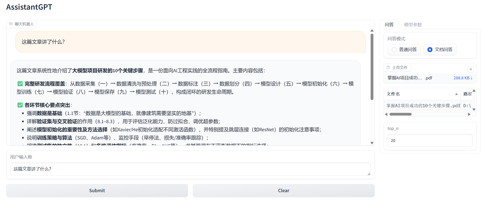
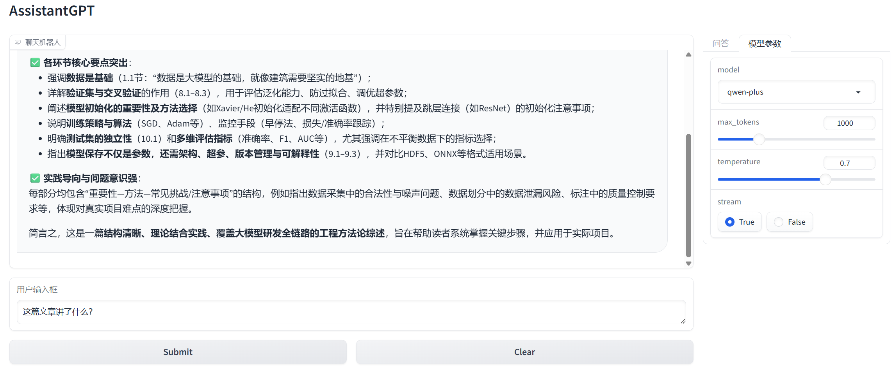

# AssistantGPT - 智能文档问答助手

基于检索增强生成(RAG)技术的智能问答系统，支持上传 PDF/TXT 文档，基于文档内容进行智能问答。




## 项目简介

AssistantGPT 是一个功能完整的 RAG 应用项目，支持两种问答模式：
- **普通问答**：与 GPT 进行自由对话
- **文档问答**：上传文档后，基于文档内容进行问答

## 技术架构

### 核心技术栈

| 技术 | 用途 | 版本 |
|------|------|------|
| Gradio | Web 界面框架 | 4.7.1 |
| LangChain | RAG 框架 | 0.0.348 |
| Qdrant | 向量数据库 | 1.16.1 |
| OpenAI/DashScope | LLM + Embedding | - |
| pdfplumber | PDF 解析 | 0.10.3 |
| tiktoken | Token 计数 | 0.5.2 |

### RAG 流程架构

```
用户上传文档(PDF/TXT)
       ↓
  文件解析 (pdfplumber)
       ↓
  文本分块 (LangChain RecursiveCharacterTextSplitter)
       ↓
  向量化 (text-embedding-v3)
       ↓
  存储向量 (Qdrant)
       ↓
─────────────── 问答时 ───────────────
       ↓
 用户问题向量化
       ↓
 向量检索 (Qdrant similarity search)
       ↓
 构建 Prompt (上下文 + 历史对话)
       ↓
 LLM 生成回答 (GPT-4 / qwen-plus)
       ↓
 返回答案
```

## 项目结构

```
llm-developing-assistantgpt/
├── app.py                      # Gradio Web 界面主程序
├── AssistantGPT.py             # GPT API 封装 (对话 + Embedding)
├── config.py                   # 配置文件 (API密钥、模型参数、分块参数)
├── utils.py                    # 工具函数 (文件处理、向量检索、Prompt构建)
├── db_qdrant.py                # Qdrant 向量数据库操作类
├── file_processor.py           # 文件处理工具类
├── file_processor_helper.py    # 文件解析辅助类 (PDF/TXT)
├── requirements.txt            # Python 依赖
├── .env.example               # 环境变量模板
└── assets/                     # 静态资源目录 项目截图 测试文档
```

## 核心模块说明

### 1. app.py - Web 界面
- 使用 Gradio 构建交互式 Web 界面
- 支持普通问答和文档问答两种模式
- 支持模型选择、参数调整、流式输出

### 2. AssistantGPT.py - API 封装
- 封装 OpenAI 兼容接口 (支持 DashScope 阿里云千问)
- `get_completion()`: 对话补全
- `get_embeddings()`: 文本向量化

### 3. db_qdrant.py - 向量数据库
- 创建/获取集合
- 添加向量 points
- 相似度搜索
- 集合管理

### 4. file_processor_helper.py - 文件处理
- PDF 文件解析 (pdfplumber)
- TXT 文件解析
- 文本分块 (LangChain RecursiveCharacterTextSplitter)
- Token 计数 (tiktoken)

### 5. utils.py - 核心业务逻辑
- `upload_files()`: 文件上传并向量化存储
- `build_context()`: 向量检索构建上下文
- `build_chat_document_prompt()`: 构建文档问答 Prompt
- `retry()`: API 调用重试机制

## 环境配置

### 1. 创建虚拟环境

```bash
conda create -n env_xiaoxiang python=3.8
conda activate env_xiaoxiang
pip install -r requirements.txt
```

### 2. 配置环境变量

复制 `.env.example` 为 `.env`，填写以下内容：

```env
# OpenAI API Key (或 DashScope API Key)
OPENAI_API_KEY=your_api_key_here

# 代理配置 (可选)
HTTP_PROXY=http://your_proxy:port
HTTPS_PROXY=http://your_proxy:port
```

### 3. 启动 Qdrant 向量数据库

```bash
# 首次 使用 Docker 启动 Qdrant
docker run -d --name qdrant -p 6333:6333 -p 6334:6334 qdrant/qdrant
# 后续 启动 Qdrant 时，直接运行
docker start qdrant
```

或者使用已运行的 Qdrant 服务，修改 `config.py` 中的地址：

```python
QDRANT_HOST = "192.168.xxx.xxx"  # 改为你的 Qdrant 地址
QDRANT_PORT = 6333
```

### 4. 启动应用

```bash
python app.py
```

启动成功后，访问 `http://127.0.0.1:7860`
线上地址：https://xxxxxxxxxxx.gradio.live/

## 使用说明

### 1. 普通问答
1. 选择「问答模式」为「普通问答」
2. 在输入框中输入问题
3. 点击 Submit 或按 Enter 发送

### 2. 文档问答
1. 选择「问答模式」为「文档问答」
2. 点击「上传文件」，选择 PDF 或 TXT 文件
3. 等待文件上传完成（文件会自动向量化存储）
4. 输入关于文档的问题
5. 系统会从文档中检索相关内容并生成回答

## 配置参数

### config.py 关键配置

```python
# 支持的模型列表
MODELS = ["gpt-3.5-turbo", "gpt-4", "qwen-plus", ...]

# 默认模型
DEFAULT_MODEL = "qwen-plus"

# 向量维度 (text-embedding-v3 = 1024)
EMBEDDING_DIM = 1024

# 文本分块参数
CHUNK_SIZE = 500        # 块大小 (token)
CHUNK_OVERLAP = 100     # 块重叠 (token)
```

## 依赖说明

```
gradio            # Web界面框架
openai            # OpenAI API客户端
qdrant_client     # 向量数据库客户端
langchain         # RAG框架
pdfplumber        # PDF解析
tiktoken          # Token计数
pandas            # 数据处理
openpyxl          # Excel支持
python-dotenv     # 环境变量
loguru            # 日志      
```

## 注意事项

1. **文件集合命名**：每个文件通过 MD5 值作为集合名，相同文件不会重复上传
2. **Token 限制**：注意模型的 max_tokens 限制，避免输出被截断
3. **API 费用**：Embedding 和 LLM 调用都会消耗 API 配额
4. **代理问题**：国内访问 OpenAI 可能需要配置代理

## 扩展开发

### 支持更多文件类型

在 `file_processor_helper.py` 中添加新的解析方法：

```python
# 示例：添加 Word 文档支持
@staticmethod
def word_file_to_docs(file_path: str) -> List[Document]:
    # 使用 python-docx 解析
    ...
```

然后在 `file_to_docs()` 的 `strategy_mapping` 中注册即可。

### 更换向量数据库

修改 `db_qdrant.py`，参考 Qdrant API 实现类似接口：

- `get_points_count()`
- `add_points()`
- `search()`

可以替换为 Milvus、ChromaDB、Weaviate 等。

### 更换 Embedding 模型

在 `AssistantGPT.py` 的 `get_embeddings()` 方法中更换模型：

```python
response = self.client.embeddings.create(
    input=input,
    model='text-embedding-v3',  # 更换为其他模型
)
```

注意：向量维度需与 Qdrant 集合的 `size` 参数一致。